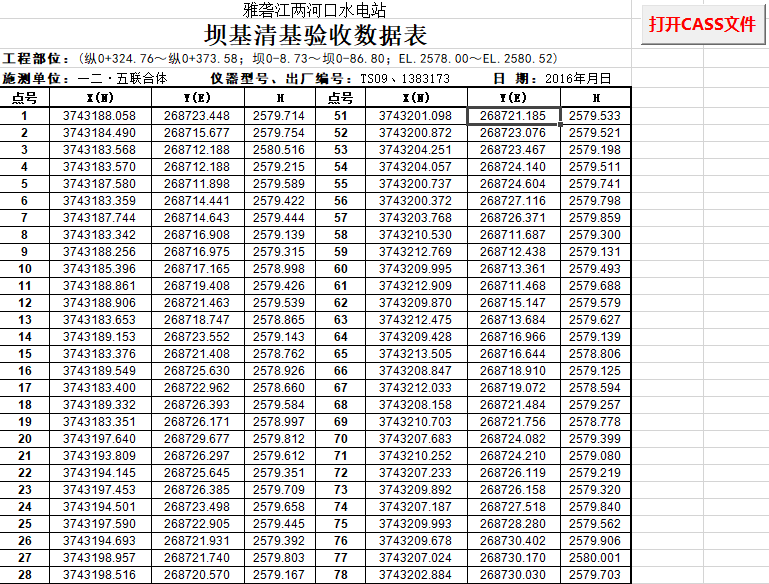
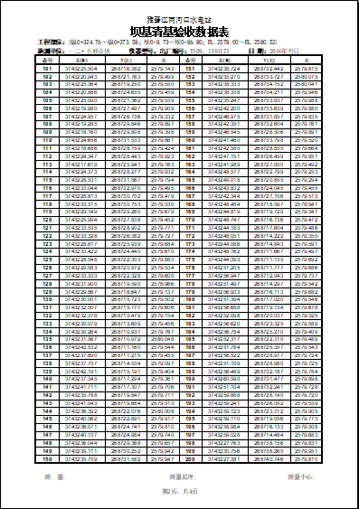
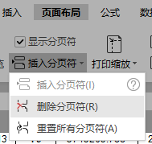

* content
{:toc}
### 程序要求

外业测量结束后成果数据从仪器下载后，需要立即打印成纸质版各方签字后存档。每次测量生成的数据或多或少，而完全靠人工排版不仅工作量巨大单调，且时间不允许。因此利用Excel或WPS宏进行批处理就显得非常必要。两河口水电站大坝标测量成果利用VBA宏完成测量成果的打印，效果较好。生成的表格如下图：



生成的数据表打印预览：



当初在设置表格时所有参数均设置在VBA代码中，因近期将前往新的工地，此表格需作通用性调整。

> WPS表格中删除分页符的方法：选中分页符下一行第一列的单元格，在”页面布局“工具面板上的”插入分页符“工具列表中用”删除分页符“删除添加的分页符。自动产生的分页不能用此方法删除。



以下代码在每页尾部自动添加一个分页符，以前的表格通过设置自动产生分页，在打印环境发生变化如不同的打印机和调整页眉、页脚后就会人页错位。按数据个数指定分页可有效避免分页错乱。

```vb
ActiveSheet.HPageBreaks.Add Before:=Range("A" & ((PageIndex + 1) * 50 + Start_Row)) '每一页尾添加分页符
```

