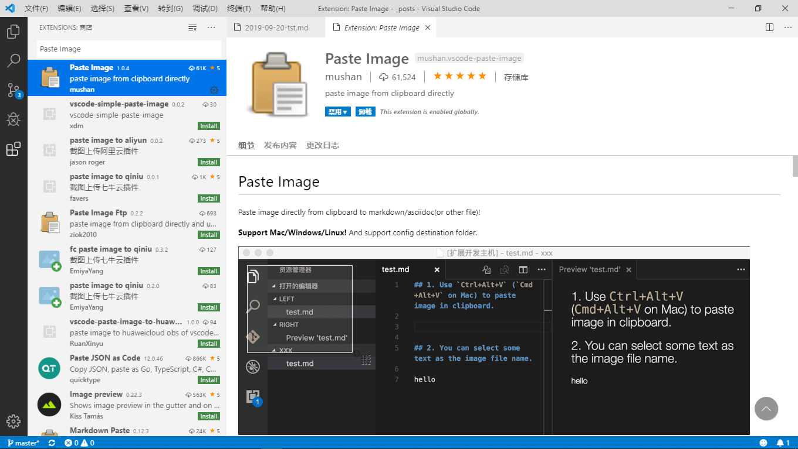
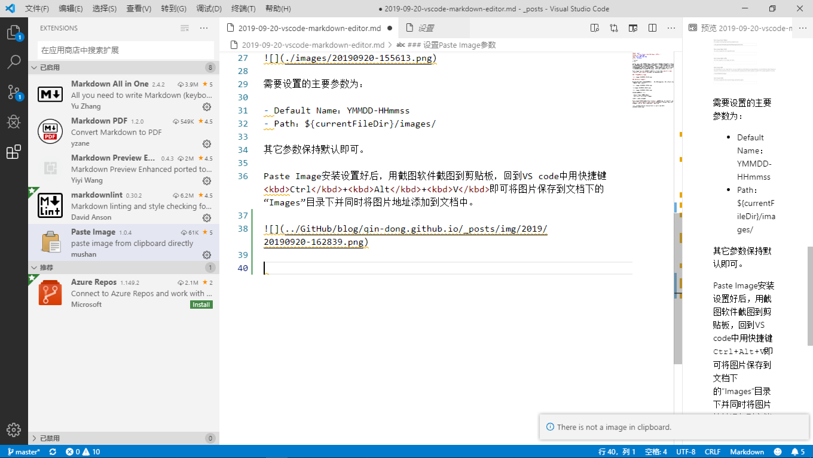

* content
{:toc}

一直想找一个功能齐全的Markdown编辑器，最好是能粘贴图片并自动将图片保存到指定目录且在文中添加图片地址。经过耐心的寻找、安装试用，发现“Typora”非常不错。此软件对粘贴图片支持较好，而且是同步渲染预览。但在安装Visual Studio Code后在扩展插件的支持下，也能实现相同功能，而且VScode功能更多，界面更美观，非常满意。现就VScode完善Markdown编辑器功能进行的设置详述如下：

Paste Image是一个截图粘贴的插件。用截图软件截图后，<kbd>Ctrl</kbd>+<kbd>Alt</kbd>+<kbd>v</kbd>粘贴到markdown文档上。

### 安装扩展Paste Image

### 设置Paste Image参数

Markdown文章所用图片均存放在文档同目录下的“images”子目录下，Paste Image参数主要参数作如下设置：

需要设置的主要参数为：

- Default Name：YMMDD-HHmmss
- Path：${currentFileDir}/images/

其它参数保持默认即可。

Paste Image安装设置好后，用截图软件截图到剪贴板，回到VS code中用快捷键<kbd>Ctrl</kbd>+<kbd>Alt</kbd>+<kbd>V</kbd>即可将图片保存到文档下的“Images”目录下并同时将图片地址添加到文档中。

